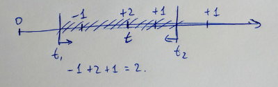
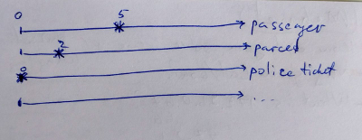
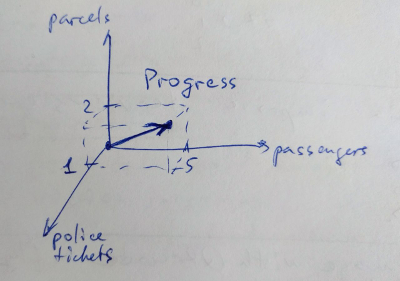
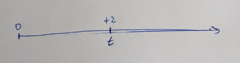

## Gamificationjs - the plug-and-play gamification engine

In short, the service should provide an easy to install and quick to kick-start gamification of any project by keeping a flexible model of levels, score counting, different types of goals to provide a game-like experience in any other project. Participants are assumed to compete with each other or maybe in some situations create groups or tribes. All goals and rewards must be trackable to show the historical changes.

**NOTE:** if you're a game developer and know more things how to setup the basis, you're very welcome to give your feedback how the engine may be drafted.

----

### Purpose

The gamificationjs aims to become a plug-and-play service to instantly make possible to introduce competition between users or softly lead into some direction (by giving rewards as incentives). It should be possible to quickly describe a game model and start using the service without additional coding of the service.

### Theory & Metrics

Any game where users compete with each other or may possible unite into groups have following concepts. For clarity in most cases we will use a taxi mobile app where we should gamify the quality of service as well as number of passengers etc.

  - Dimension - is simply something countable. In case of taxi service we can set passengers, parcels, accidents, police tickets as countable values which we will call Dimensions. A dimension can be imagined as a timeline on which we put events with adding or deducting from the score. for some types there are restrictions like only positive and integer values (passengers) or only negative (damage). This is the reason to introduce a Step of Dimension.
  - Step - a smallest unit adible to a Score. Step should be a characteristic of a Dimension and does not make sense detached.
  - Score - is a number (count) on a given Dimension on timeline. Fox example, my taxi driving score is 8 passengers in total for all time. Since we deal with time, we have to specify the period of counting - this will allow to use advanced techniques of gamification. Clearly enough, I can have 5 passengers today and only 3 yesterday.

  

  **The axis represents timeline with an event point on it.*

  - Progress - is a general overview of a user activity resulting in gaining or loosing some points in the given dimensions. For example in the **2-dimensional space** with dimensions Passengers and Police Tickets, my current progress would be a vector with two values [5 Passengers, 0 Police Tickets].

  

  **The axis represent dimentions, not a timeline*

  

  **The axis represent dimentions, not a timeline*

  - ScoreEvent - is the final basic concept required to build the draft. It's an event from a system which is just a multiplier of a Step on a Dimension. It's a **point** on the time axis of the Dimension which produces difference in resulting Score.

  

  **The axis represents timeline with an event point on it.*

  - Goal - is a **point** in the gamification space which can be described as vector as well: [5 Passengers, 0 Police Tickets]. Considering that there may be time boundaries for a Goal, the point may have starting and ending time as well: [5 Passengers, 0 Police Tickets, today from 6AM, tomorrow till midnight]. Simpler version of any goal would be just count for all times.
    - Reward - an attribute of a Goal. Should be given to a User as soon as the Goal is crossed.
    - Achievement - an attribute of a Goal. For some reason it was used separately from Reward. Probably the Reward is given once and may contain some coins or other values while Achievements are similar to statuses which may be given or taken depending on the progress (WIP|TBD).
    - Badge - an attribute of a Goal. In original idea it was an image or URL to an image that should be given to a user if he achieved the Goal. Maybe it should be a part of the Reward for simplification (WIP|TBD).
    - Bonus score - an attribute of a Goal. Original idea assumed existance of a general score for each user which then helped to count a Level and give badges. In that case the bonus score would be added up to the general score. In case of replacement of the general score with some coins, makes sense to use them instead (WIP|TBD).
  - Total Score - is a calculated value potentially used for comparison of users. The formula by which it is calculated should be equal for all users. It will make more sense if you think of a money value of each ScoreEvent. For example one passenger ride would be +$20 and one parcel delivered for example +$10 while one police ticket is -$100. Having reached a Goal of 5 passengers and 2 parcels delivered with zero accidents and one police ticket, would give you some monetary value of `5 x (+$20) + 2 x (+$10) + 1 x (-$100) = $20` - and we can count this as a Progress for given period of time or as a Total Score of all times. This concept does not always work well with different types of countable values, so it's considered optional. But it may be useful for example for calculation of a Level which is also a generic view on a progress of a user.
  - Level - sequence of numbers of TotalScore to acquire new badge or title if passed the according number
  - Coins - TBD

### Gamification elements

 - Score - for comparison of users, to build a score table
 - Badge - for eye-catching differences between "players"
 - "Player" Title - TBD
 - Level - TBD
 - Coins - TBD

### TODO

 - dockerize the server-side of the engine
 - replace Knex and Bookshelf with Sequelize or better alternative
 - add NoSQL driver to be able to connect Mongodb instead of SQL-database
 - update models according to the updated concepts in this README, update migrations if needed
 - add demo page with examples how to fetch data and show it
 - add visual components with badges, scorecard, progressbar with Reactjs
 - suggest an update of current TODO list or README
